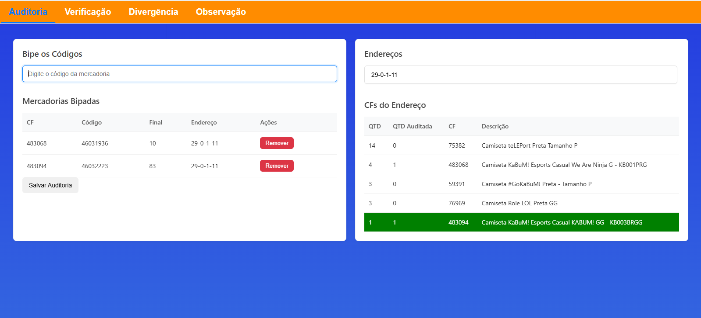
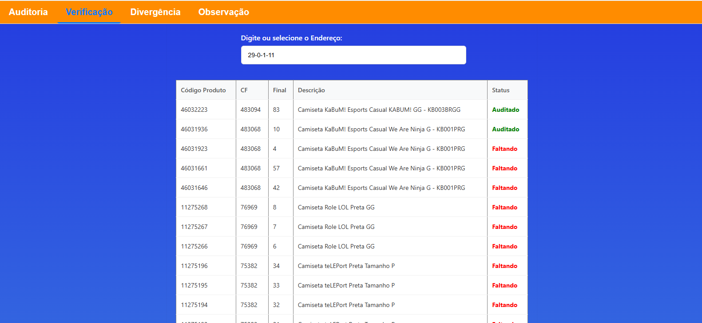
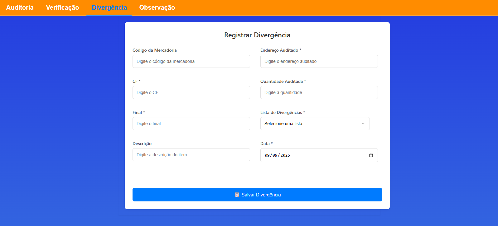
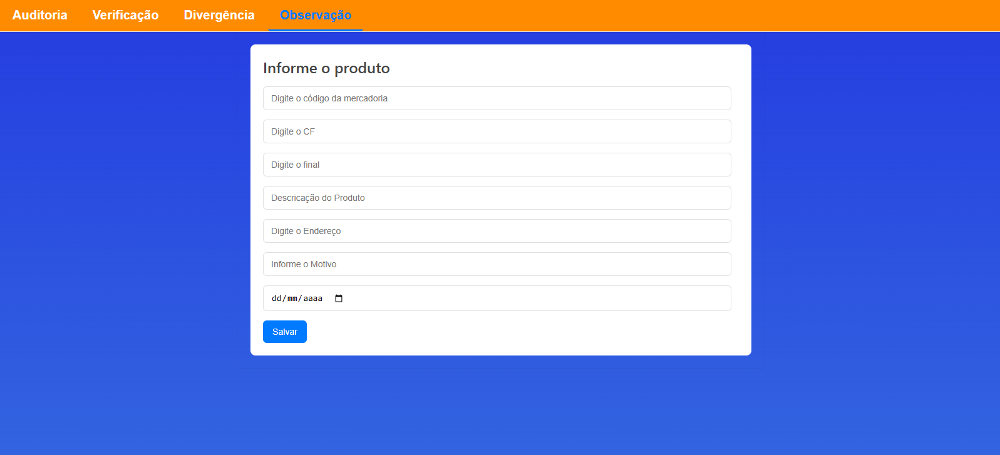

# Sistema de Auditoria de Estoque 📊

   

## 📄 Sobre o Projeto

O **Sistema de Auditoria de Estoque** é uma aplicação web completa, desenvolvida para simplificar e digitalizar o processo de contagem e verificação de inventário em um armazém. A ferramenta oferece uma interface amigável e otimizada para coletores de dados, permitindo que os operadores realizem a auditoria de endereços físicos, registrem produtos e apontem divergências de forma rápida e precisa.

Utilizando a plataforma **Google Apps Script**, o sistema funciona como um frontend robusto para uma **Planilha Google**, que atua como banco de dados. Isso cria uma solução de baixo custo, alta performance e fácil manutenção para o gerenciamento de inventário.

## ✨ Principais Funcionalidades

O sistema é dividido em quatro abas principais, cada uma com uma função específica no ciclo de auditoria:

1.  **Auditoria:**
    * **Seleção de Endereço com Autocomplete:** Permite ao auditor selecionar rapidamente o endereço a ser contado.
    * **Contagem por Bipagem:** O operador pode usar um leitor de código de barras para "bipar" os produtos, que são adicionados a uma lista de contagem.
    * **Validação em Tempo Real:** O sistema verifica se o produto bipado pertence ao endereço selecionado, marcando-o em vermelho caso haja inconsistência.
    * **Painel de Conferência:** Uma tabela dinâmica exibe o progresso da contagem, mostrando a quantidade total de produtos (CFs) no endereço e quantos já foram auditados.
    * **Cadastro de Novos Itens:** Permite adicionar produtos não encontrados na base de dados diretamente pela interface, através de um modal.

2.  **Verificação:**
    * **Relatório de Faltas e Sobras:** Após a contagem, esta aba permite selecionar um endereço e visualizar um relatório claro dos itens que foram contados ("Auditado") e dos que não foram encontrados ("Faltando").

3.  **Divergência:**
    * **Formulário de Registro:** Uma interface dedicada para registrar qualquer tipo de divergência encontrada (avarias, falta de etiqueta, erro de endereçamento, etc.), salvando os dados em uma planilha de controle específica para análise posterior.

4.  **Observação:**
    * **Apontamentos Gerais:** Permite registrar observações sobre produtos específicos que não necessariamente são uma divergência, mas que precisam de atenção.

## 💻 Tecnologias Utilizadas

* **Frontend:** HTML5, CSS3, JavaScript (Vanilla JS)
* **Backend & Automação:** Google Apps Script
* **Banco de Dados:** Google Sheets

## 🚀 Como Configurar e Usar

Para implementar este projeto, você precisará configurar o ambiente no Google Workspace:

1.  **Crie a Planilha Google Principal:**
    * Crie uma nova Planilha Google que servirá como sua base de dados.
    * Crie as seguintes abas (planilhas) dentro dela:
        * `Dados`: Para armazenar a lista mestra de todos os produtos, com as colunas: **CF, Código, Final, Descrição, Endereço**.
        * `Rascunho`: Onde os resultados da auditoria serão salvos.
        * `ITENS OBSERVAÇÃO`: Para armazenar os registros da aba "Observação".

2.  **Crie a Planilha de Divergências (Opcional):**
    * Crie uma segunda Planilha Google para registrar as divergências.
    * Crie uma aba chamada `2025` (ou o nome que preferir).
    * Copie o ID desta planilha (encontrado na URL).

3.  **Configure o Google Apps Script:**
    * Na sua planilha principal, vá em `Extensões > Apps Script`.
    * No editor de script, cole o conteúdo do arquivo `doGet(e)` e as outras funções do backend.
    * **Importante:** Se você criou uma planilha separada para divergências, atualize a variável `outraPlanilhaID` na função `SalvarDivergencia` com o ID correto.
    * Crie um novo arquivo HTML (`Arquivo > Novo > Arquivo HTML`) e nomeie-o como `interface` (ou o nome usado na função `createTemplateFromFile`).
    * Cole todo o código do frontend (HTML, CSS e JavaScript) neste arquivo `interface.html`.
    * Salve o projeto.

4.  **Implante como Aplicativo Web:**
    * Clique em `Implantar > Nova implantação`.
    * Selecione o tipo "App da Web".
    * Em "Executar como", selecione `Eu`.
    * Em "Quem pode acessar", selecione `Qualquer pessoa com uma Conta do Google` ou restrinja para sua organização.
    * Clique em `Implantar`, autorize as permissões necessárias e copie a URL do aplicativo gerado.

## 🖼️ Telas do Sistema

*(Sugestão: Adicione aqui screenshots da sua aplicação em funcionamento para enriquecer o README)*

**Aba de Auditoria:**

**Aba de Verificação:**

**Aba de Divergência:**

**Aba de Observação:**

## 👨‍💻 Autor

Feito por Ramon Madeira

